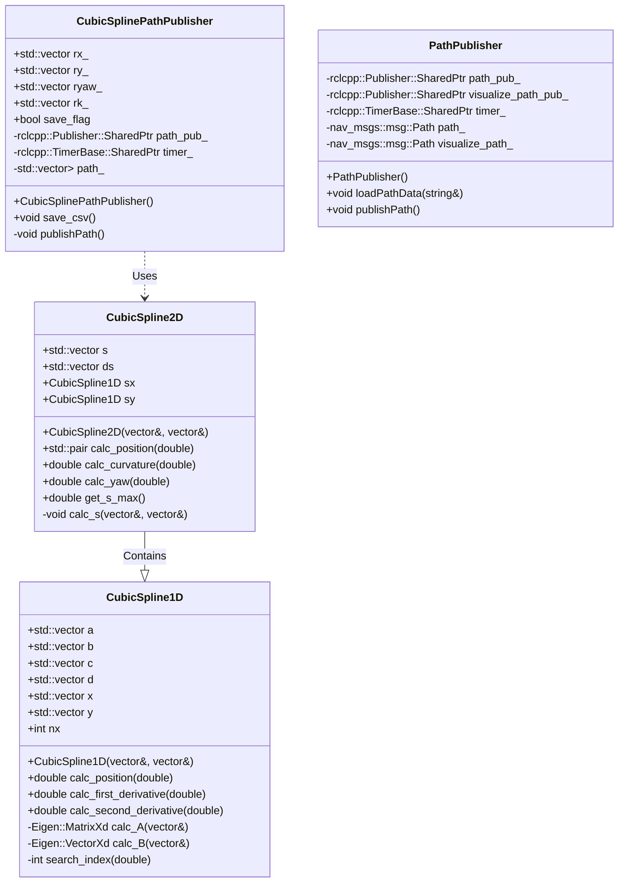
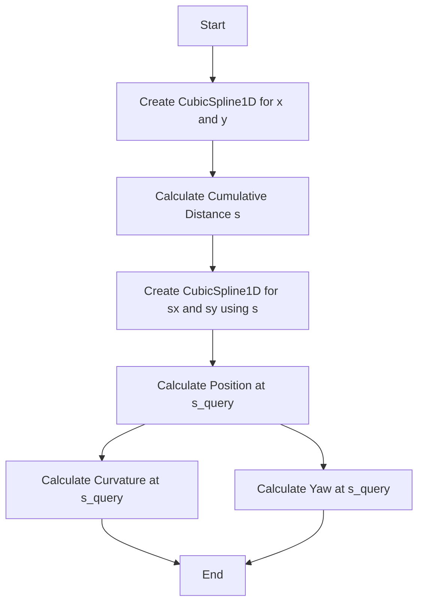

<p style="display: inline">
  <!-- Programming Language -->
  
  <!-- ROS 2 -->
  
</p>

## Functional Overview
This source code implements a cubic spline path planner for autonomous vehicles or robots. 

## Requirements
### System Requirements
- OS : Ubuntu 22.04  
- ROS2 : Humble

## How To Use
### Execution Steps
```bash
cd ~/ros2_ws
source ~/ros2_ws/install/setup.bash
ros2 launch path_smoother path_smoother.py
```

### Folder structure
```
path_smoother/
├── include/                     - Directory for header files
│   └── path_smoother/           - Header files for the path_smoother package
│       ├── cubic_spline_1d.hpp  - Implementation of 1D cubic spline
│       └── cubic_spline_2d.hpp  - Implementation of 2D cubic spline
├── launch/                      - Directory for ROS 2 launch files
│   └── path_smoother.py         - Launch script for the path_smoother node
├── path/                        - Directory for simulation path files
│   └── simulation_path.csv      - Path data for simulation (CSV format)
├── src/                         - Directory for source files
│   ├── cubic_spline_1d_node.cpp - Node implementation for 1D cubic spline
│   ├── cubic_spline_1d_component.cpp - Component implementation for 1D cubic spline
│   ├── cubic_spline_2d_node.cpp - Node implementation for 2D cubic spline
│   ├── cubic_spline_2d_component.cpp - Component implementation for 2D cubic spline
│   └── cubic_spline_node.cpp    - Node implementation for cubic spline calculation
├── CMakeLists.txt               - CMake build configuration file
└── package.xml                  - ROS 2 package metadata file
```

## Interface Table

### Input

| Variable Name      | Type            | Description                         |
|-------------------------|-------------------|---------------------------------------|
| `x`, `y`                     | `std::vector<double>`       | Input coordinates for spline interpolation.                |
| `s_query`                    | `double`                    | Query parameter for position, curvature, and yaw.          |

### Output

| Variable Name      | Type            | Description                         |
|-------------------------|-------------------|---------------------------------------|
| `calc_position()`            | `double`, `std::pair<double, double>` | Returns the position at a given query parameter `s_query`. |
| `calc_curvature()`           | `double`                    | Returns the curvature at a given query parameter `s_query`.|
| `calc_yaw()`                 | `double`                    | Returns the yaw angle at a given query parameter `s_query`.|
| `get_s_max()`                | `double`                    | Returns the maximum value of the parameter `s`.            |

### Internal Values

| Variable Name      | Type            | Description                         |
|-------------------------|-------------------|---------------------------------------|
| `a`, `b`, `c`, `d`           | `std::vector<double>`       | Coefficients for the cubic spline interpolation.           |
| `nx`                         | `int`                       | Number of data points.                                     |
| `s`, `ds`                    | `std::vector<double>`       | Parameters for the 2D spline.                              |
| `sx`, `sy`                   | `CubicSpline1D`             | 1D splines for the x and y coordinates.                    |
| `rx_`, `ry_`, `ryaw_`, `rk_` | `std::vector<double>`       | Results of spline interpolation (position, yaw, curvature).|
| `path_`                      | `std::vector<std::vector<double>>` | Path data for saving to CSV.                              |
| `path_pub_`                  | `rclcpp::Publisher`         | ROS 2 publisher for the path.                              |
| `timer_`                     | `rclcpp::TimerBase`         | ROS 2 timer for publishing the path.                       |

## Software architecture

### Class Diagram



### Flowchart


## Functional Requirements

## Detailed Design
