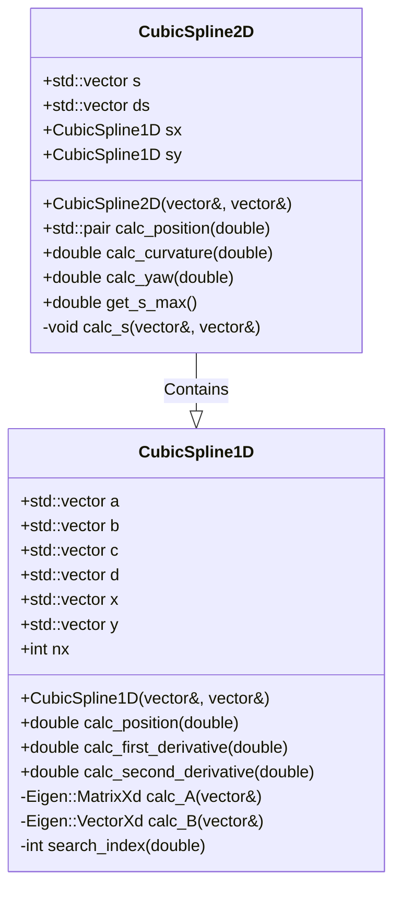

<p style="display: inline">
  <!-- Programming Language -->
  
  <!-- ROS 2 -->
  
</p>

## Functional Overview

## Requirements
### System Requirements
- OS : Ubuntu 22.04  
- ROS2 : Humble

## How To Use
### Execution Steps
```bash
cd ~/ros2_ws
source ~/ros2_ws/install/setup.bash
ros2 launch path_smoother path_smoother.py
```

### Folder structure
```
path_smoother/
├── include/                     - Directory for header files
│   └── path_smoother/           - Header files for the path_smoother package
│       ├── cubic_spline_1d.hpp  - Implementation of 1D cubic spline
│       └── cubic_spline_2d.hpp  - Implementation of 2D cubic spline
├── launch/                      - Directory for ROS 2 launch files
│   └── path_smoother.py         - Launch script for the path_smoother node
├── path/                        - Directory for simulation path files
│   └── simulation_path.csv      - Path data for simulation (CSV format)
├── src/                         - Directory for source files
│   ├── cubic_spline_1d_node.cpp - Node implementation for 1D cubic spline
│   ├── cubic_spline_1d_component.cpp - Component implementation for 1D cubic spline
│   ├── cubic_spline_2d_node.cpp - Node implementation for 2D cubic spline
│   ├── cubic_spline_2d_component.cpp - Component implementation for 2D cubic spline
│   └── cubic_spline_node.cpp    - Node implementation for cubic spline calculation
├── CMakeLists.txt               - CMake build configuration file
└── package.xml                  - ROS 2 package metadata file
```

## Interface Table

### Input

### Output

### Internal Values

## Software architecture

### Class Diagram



### Flowchart


## Functional Requirements

## Detailed Design
